# 🚀 CodeVerse Learning Portal

A full-stack Programming Language Learning Portal built using React, Tailwind CSS, and Spring Boot.

This platform helps students and beginners learn programming languages with structured roadmaps, coding practice, mock interviews, mock tests, progress tracking, and study materials in an interactive way.

---

# 📌 Features

- 📚 Programming Study Materials
- 💻 Coding Practice Questions
- 🧠 Mock Interview Preparation
- 📝 Mock Tests & Quiz System
- 🛣️ Learning Roadmaps
- 📈 Progress Tracking Dashboard
- 🔊 Text-to-Speech Study Notes
- 📄 Technical Interview Questions
- 📱 Responsive User Interface
- 🔐 Full Stack Architecture

---

# 🛠️ Tech Stack

## Frontend
- React.js
- Tailwind CSS
- JavaScript (ES6+)

## Backend
- Spring Boot
- Java
- REST API

## Tools
- Git & GitHub
- VS Code
- Maven

---

# 📂 Project Structure

```bash
programming-portal
│
├── frontend
│
├── backend
│   └── userbackend
│
├── screenshots
│
└── README.md
```

---

# 🎯 Project Objective

The main objective of this project is to provide a modern platform for students to learn programming languages, prepare for interviews, practice coding, and track their learning progress efficiently.

---

# ✨ Key Highlights

- Full Stack Web Application
- Modern Responsive UI
- Student-Centric Features
- REST API Integration
- Clean Project Structure
- Beginner-Friendly Learning Experience

---
# 📸 Screenshots

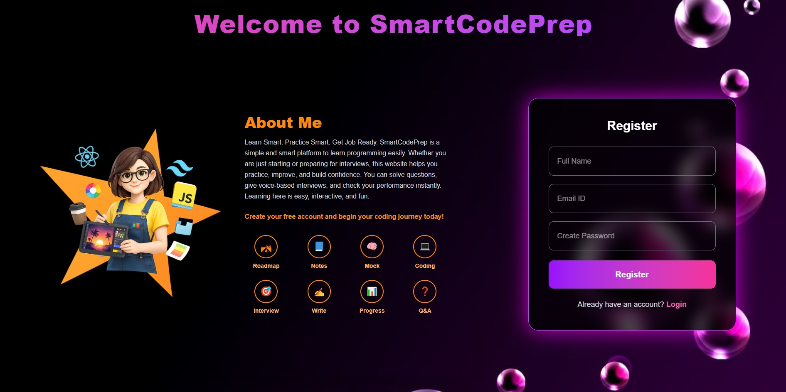

---

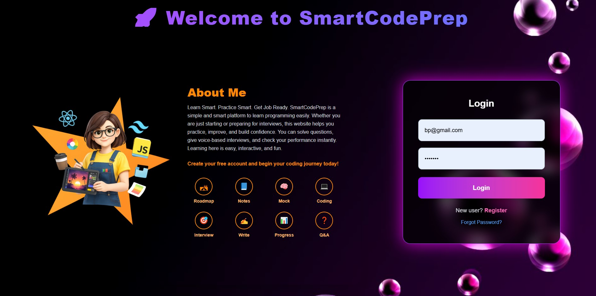

---

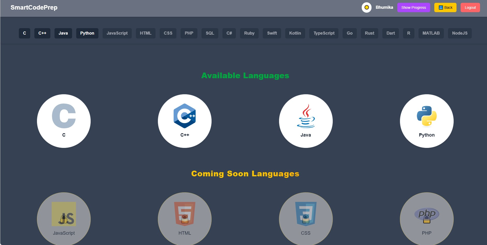

---

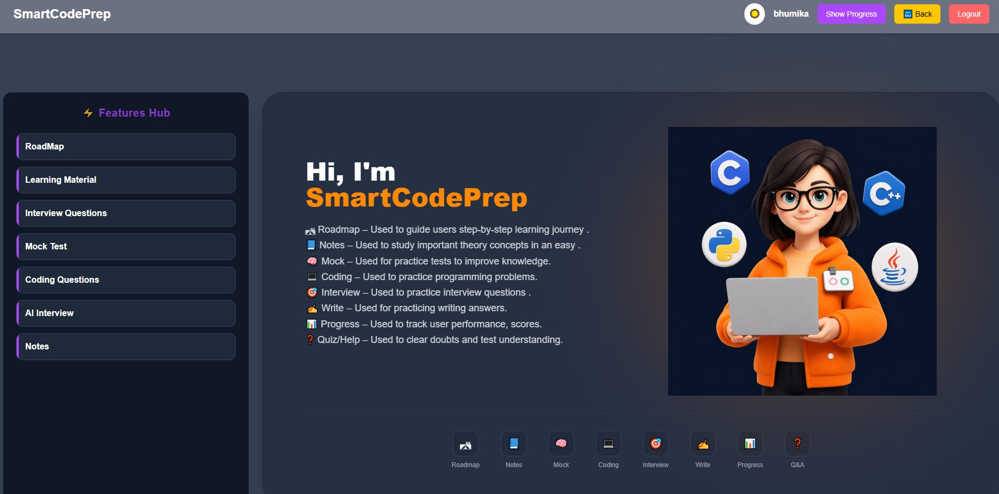

---

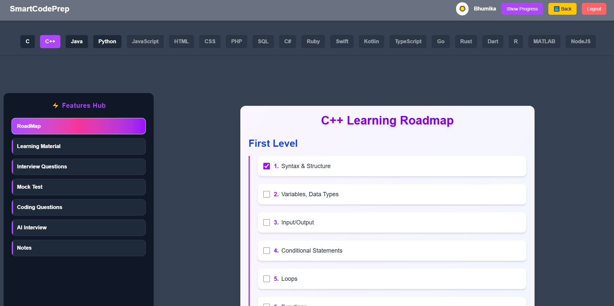

---

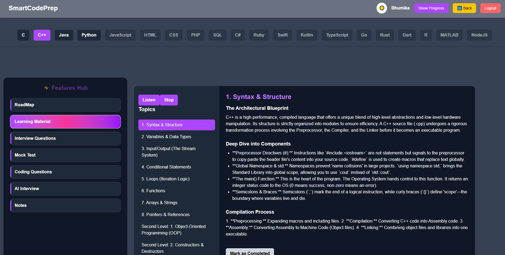

---

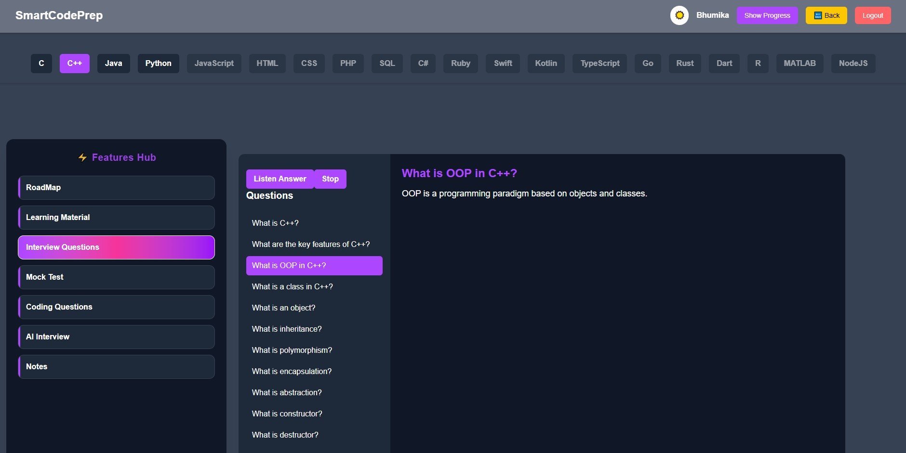

---

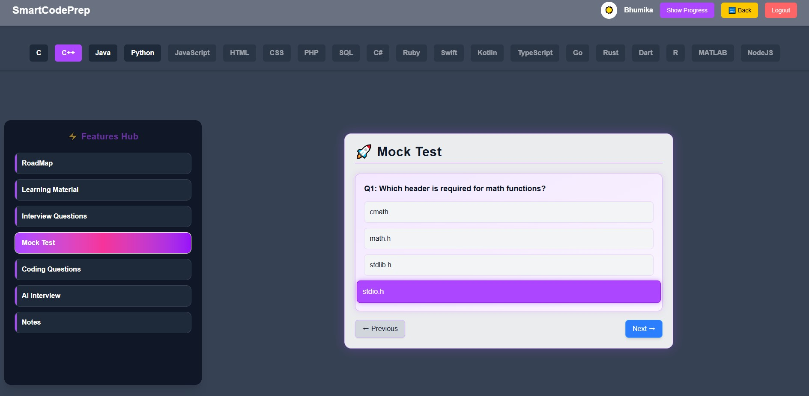

---

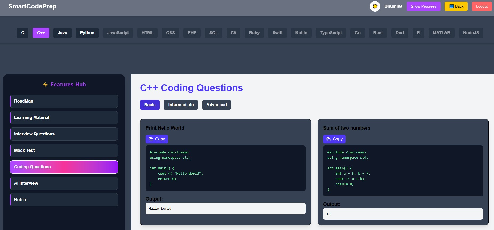

---

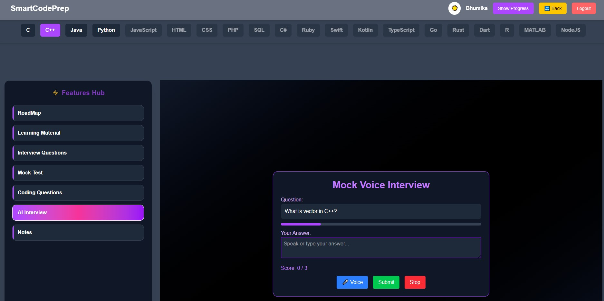

---

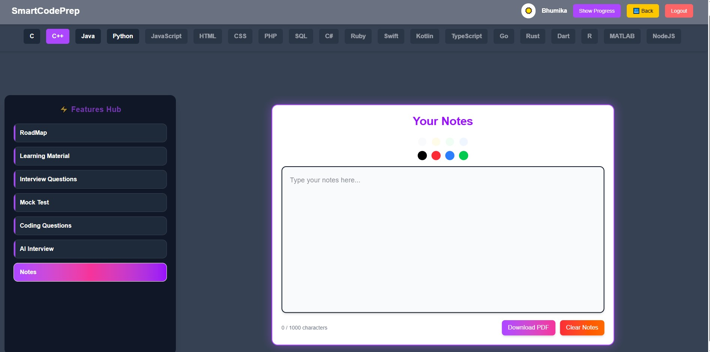

---

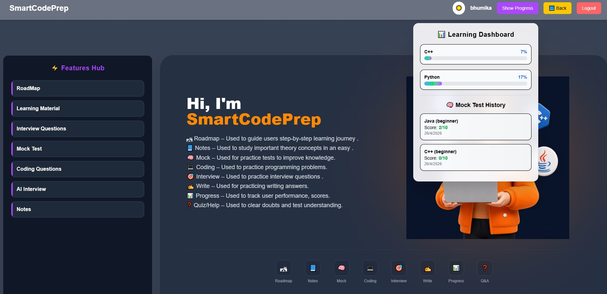

---

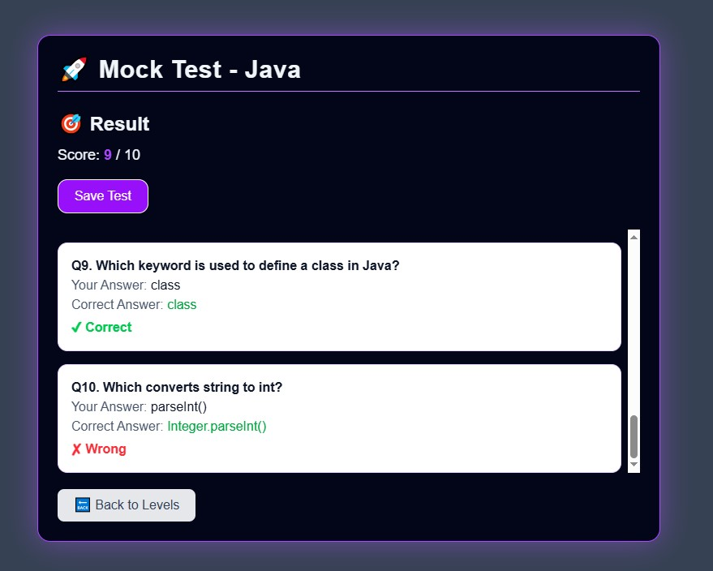

---

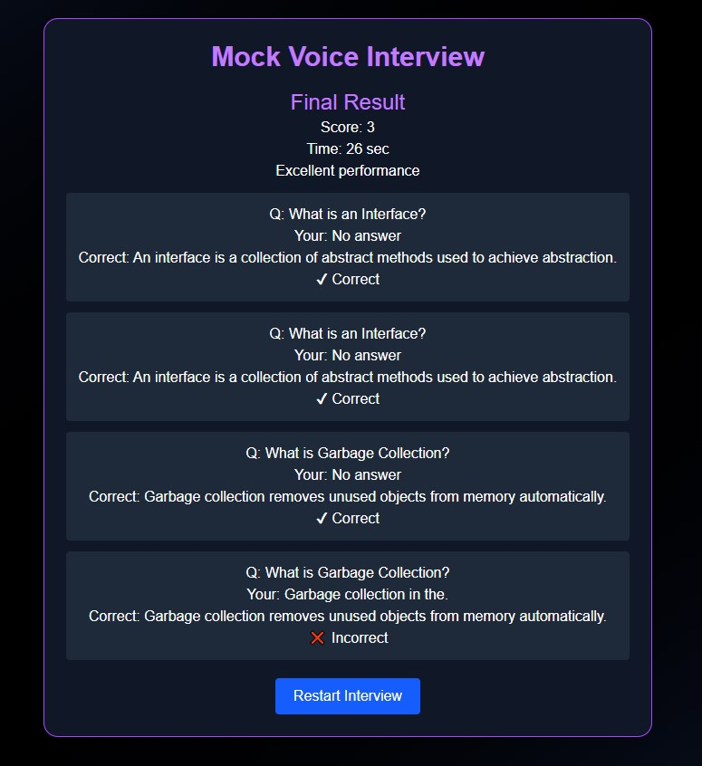


**Bhumika Patil**  
Computer Engineering Student  
Aspiring Java Full Stack Developer

GitHub:  
https://github.com/Bhumika1104

---

# ⭐ Repository

If you like this project, give it a ⭐ on GitHub.
